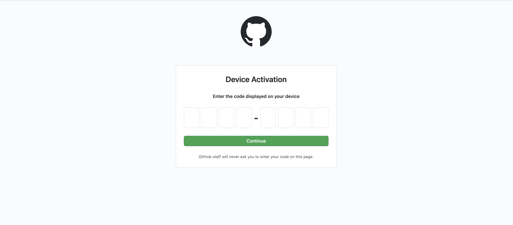
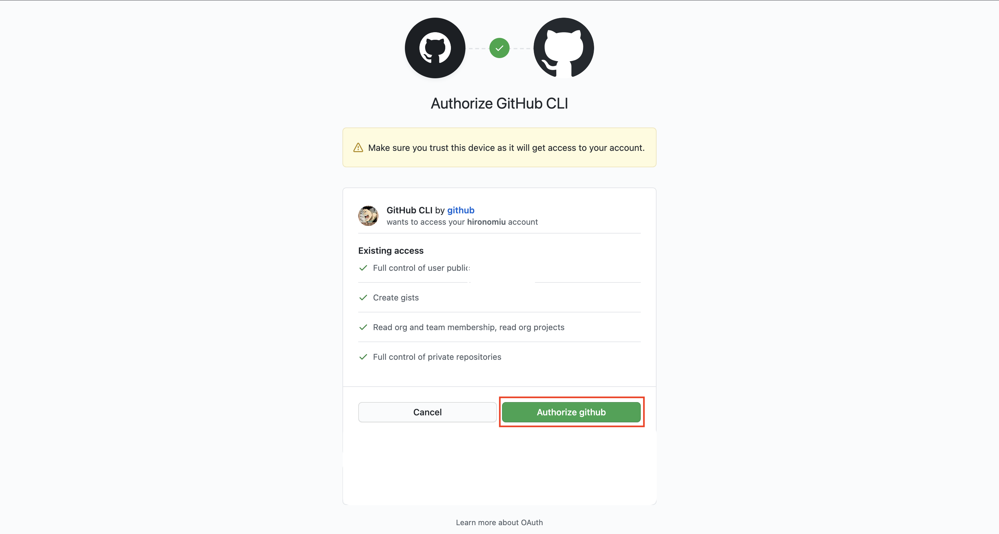
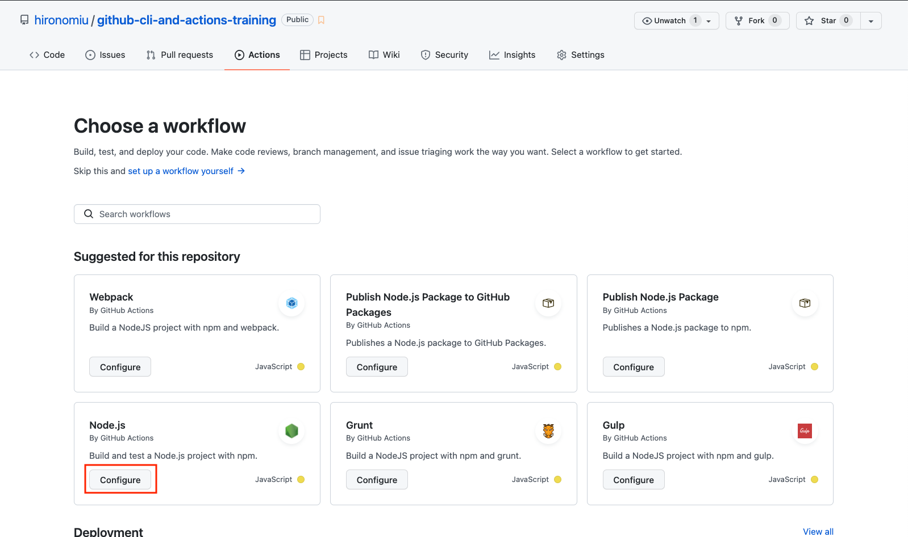
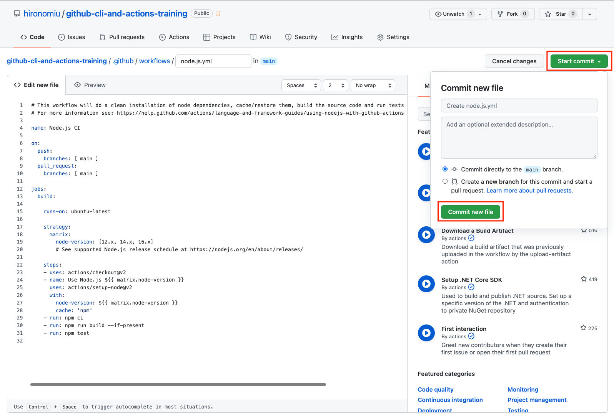

# github-cli-and-actions-training

[](https://github.com/hironomiu/github-cli-and-actions-training/actions/workflows/node.js.yml)

GitHub CLI & Actions 練習用レポ

## 公式サイト

[GitHub CLI ](https://cli.github.com/)

## GitHub CLI Install & SetUp

```
brew install gh
```

GitHub との認証

```
% gh auth login
? What account do you want to log into? GitHub.com
? What is your preferred protocol for Git operations? SSH
? Generate a new SSH key to add to your GitHub account? No
? How would you like to authenticate GitHub CLI? Login with a web browser
```

ブラウザで未ログインの場合はログインする


```
! First copy your one-time code: XXXX-XXXX <- ブラウザに入力する
- Press Enter to open github.com in your browser...
✓ Authentication complete. Press Enter to continue...
```

XXXX-XXXX(実際に表示された値)を入力する



押下する



成功したらターミナルに戻る


エンターで終了

```
- Press Enter to open github.com in your browser...
✓ Authentication complete. Press Enter to continue...

- gh config set -h github.com git_protocol ssh
✓ Configured git protocol
✓ Logged in as hironomiu
```

## コマンド補完

コマンド補完について

[Homebrew Shell Completion](https://docs.brew.sh/Shell-Completion)

bash

```
if type brew &>/dev/null; then
  HOMEBREW_PREFIX="$(brew --prefix)"
  if [[ -r "${HOMEBREW_PREFIX}/etc/profile.d/bash_completion.sh" ]]; then
    source "${HOMEBREW_PREFIX}/etc/profile.d/bash_completion.sh"
  else
    for COMPLETION in "${HOMEBREW_PREFIX}/etc/bash_completion.d/"*; do
      [[ -r "$COMPLETION" ]] && source "$COMPLETION"
    done
  fi
fi
```

zsh

```
if type brew &>/dev/null; then
  FPATH=$(brew --prefix)/share/zsh/site-functions:$FPATH

  autoload -Uz compinit
  compinit
fi
```
## GitHub CLI コマンドライン

### Issue

#### create

```
$ gh issue create
```

以降の手順

```
Creating issue in hironomiu/github-cli-and-actions-training

? Title issue作成テスト７ <- タイトルの記述
? Body <Received> <- nanoでファイルを編集(編集後CTRL + X -> yでセーブ、エンターで抜ける)
? What's next? Submit <- Submitで確定
```

### Pull Request

#### create

```
gh pr create
```

以降の手順

```
? Title issue7取り込み <- タイトルの記述
? Body <Received> <- nanoでファイルを編集(編集後CTRL + X -> yでセーブ、エンターで抜ける)
? What's next? Submit <- Submitで確定
```

#### merge

```
gh pr merge
```

以降の手順

```
? What merge method would you like to use? Create a merge commit
? Delete the branch locally and on GitHub? Yes
? What's next? Submit
```

## Actions

[node.js.yml](./.github/workflows/node.js.yml)

今回はGitHubで提供しているテンプレートから作成

Actions -> New workflow -> Node.js -> Configureを押下



適時編集(例 [node.js.yml](./.github/workflows/node.js.yml))しStart commitから「Commit new file」を押下



## 動作確認コード作成

### Package Install

`package.json`に動作用に必要なパッケージは記載済み

```
$ yarn install
```

### コード

`.src/`配下に`main.js`を配置済み(FizzBuzzの実装)
s
### Testing

上記コードのFizzBuzzについて`./tests`にテストコードを配置済み

```
$ yarn test
```

結果
```
https://github.com/browserslist/browserslist#browsers-data-updating
 PASS  tests/fizzBuzz.test.js
  ✓ 1を入力したら文字列1を返す (2 ms)
  ✓ 2を入力したら文字列2を返す
  ✓ 3を入力したら文字列Fizzを返す (1 ms)

 PASS  tests/main.test.js
  ✓ test 1 (2 ms)
  ✓ test 2 (2 ms)

Test Suites: 2 passed, 2 total
Tests:       5 passed, 5 total
Snapshots:   0 total
Time:        1.729 s
```

## memo

nodenv にて`local 16.2.0`に設定

```
nodenv local 16.2.0
```

### TypeScript Install Memo

```
yarn add --dev typescript @types/node ts-node
npx tsc --init
mkdir src
```

#### Package.json

`scripts`

```
"build": "tsc"
```